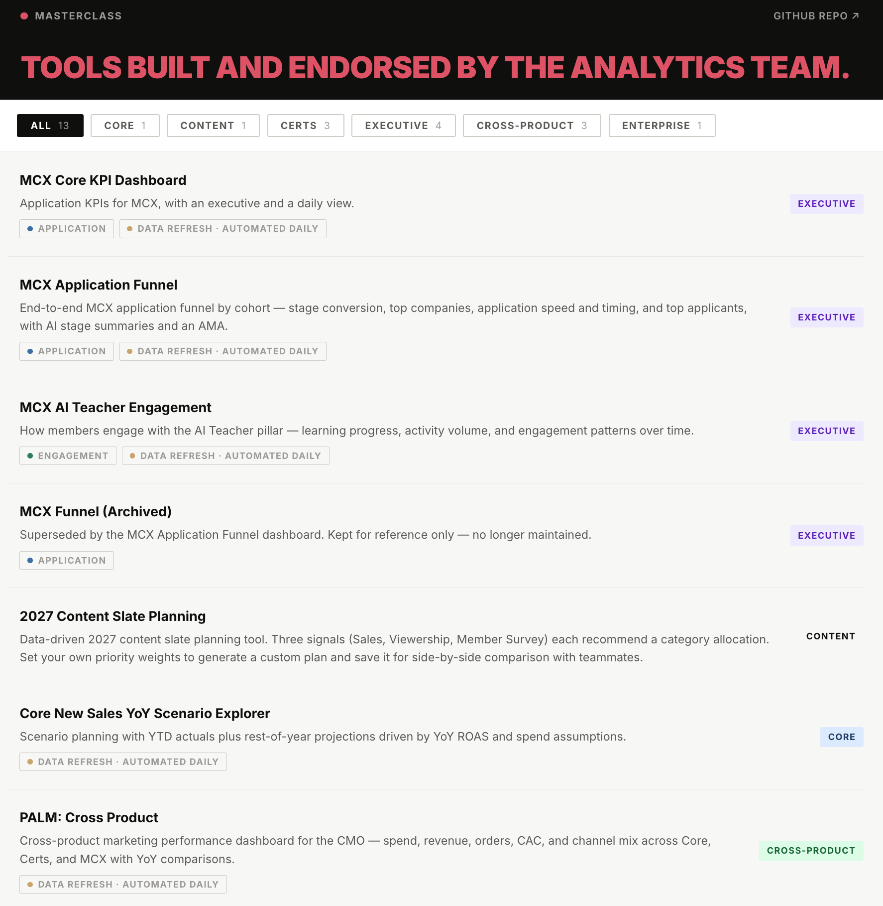

*Stack: Claude, Google Apps Script, Google Sheets, GitHub Actions, Looker.*

## Summary

In April 2026 I built two Google Apps Script apps: a new sales YoY scenario explorer for exec reforecasting discussions, and an intranet page that catalogs the analytics team's apps. Around them I set up a GitHub monorepo with one shared deploy workflow, where each app either goes live on every code push or lands on a test URL until a person promotes it. Then I shared the live app, the README, and the build notes with my 9 analytics team colleagues.

Five months later, 11 Apps Script apps are live on the intranet. This post covers what I built, how the workflow pattern works, and what made it spread.

## Why I built this

Our data app use cases lean toward BI dashboards and interactive data tools. We had two build paths and each carried friction.

Looker dashboards without an AI coding agent are slow to build: point and click, plus manual LookML.

Claude artifacts were much faster, and the team already used them for patterns Looker couldn't do easily. Without automated data refresh they stayed one off solutions. An artifact with static data serves one meeting, not a tool people rely on.

The spark was our CFO, who built an AI project tracker with Google Apps Script. That gave me the idea to bring internal data apps to Apps Script.

## What I built

The need came up on a Monday afternoon: combine actuals and rest of year projections into full year YoY sales scenarios for exec reforecasting. The app was in production Tuesday morning. About 4 hours of work, including learning this pattern for the first time.

The scenario explorer reads daily sales and marketing spend from a Google Sheet, lets users adjust assumptions on sliders, and shows YoY projections in charts and tables with an actuals, rest of year, and full year blended toggle.

The intranet page is itself an app in the repo. It lists every published app by business area, with filters and a feedback and app request form that posts to Slack with the requester's email attached. One list at the top of the code drives the whole page. Adding an app is adding one entry. An example view of the intranet page:

{fig-alt="Screenshot of the analytics team's intranet page. Apps are grouped under business area headings, with filter pills across the top and a feedback and app request form."}

### The workflow pattern

This is the part I shared, and the part others built on.

1. **Prototype as a Claude artifact.** Prompt Claude with what the tool should do, iterate on charts and tables in conversation, test with real data. Get the UX right before anything ships. About 1 hour.

2. **Convert the artifact to Apps Script.** Ask Claude to generate a Google Apps Script version of the artifact. Same interface, now two files Apps Script can serve. About 1 hour.

3. **Point it at a Sheet that refreshes itself.** A Looker schedule writes to a Google Sheet tab every morning. The app reads that tab when it loads. No database connection, no query.

4. **Ask Claude to review the code it just wrote.** Two rounds, framed as a senior engineer audit. It caught real bugs I would not have seen, including dates showing a day off for West Coast users. About 30 minutes.

5. **Version control and auto deploy.** Connect the GitHub mono repo to Claude, so edits land in the repo with no copy and paste. Every push to GitHub deploys to Apps Script, restricted to our Google Workspace. Each app has a short config file naming its folder and credentials, and one shared workflow does the deploying for every app. Claude adds a new app by copying that file and changing two values.

6. **Choose the deploy path with one credential.** Each app's config file either includes a production credential or leaves it out. With it, every merge updates the live URL people use. Without it, every merge updates a test URL only, and a person promotes it to live by hand in the Apps Script UI. The intranet site goes straight to live on push. The scenario explorer waits for a manual promote/review.

7. **Write build notes.** Point Claude at the build conversation and ask for a post mortem: what triggered the work, what worked, what didn't, solution overview. About 10 minutes of my time. Two readers: teammates building the next app, and the agent on the next build, which then already knows the gotchas.

## Decisions & tradeoffs

1. Apps Script over Streamlit, static hosting, a React app, or Looker. It was the fastest path to a live, lightweight data app with automated refresh, and it's self serve inside Google Workspace. The team took it further than I expected, adding Anthropic and Meta API calls inside GAS for use cases I hadn't thought of.

2. A Looker schedule into a Google Sheet over direct warehouse access. Simplicity. Apps Script reads source data inside Workspace by default, with no custom configuration.

3. One repo with no shared code over one project per app. One place to check whether a tool already exists, and Claude has context on the style guide and the tools already built. Each app folder is self contained, with no imports between apps.

4. Live on merge by default, manual promote where I wanted a look first. The choice is one optional credential per app, not a policy document.

## Mistakes & weak points

1. The first follow-on build exposed two gaps. The first colleague to ship after my example hit Apps Script setup friction the build notes didn't cover, and Claude hard coded the data into the app instead of reading the live Google Sheet. The app looked done. Code review caught it when the data didn't refresh.

2. The deploy tool only knows how to log in as a person. clasp, the command line tool that pushes our code to Apps Script, runs on my user credential rather than a service account. If that login is rotated or revoked, every deploy stops at once, as one incident rather than one per app.

3. Keys and secrets need a cleanup. Each app stores them a little differently, with no shared rule for which are shared across apps and which stay per app. The fix is one consistent method, so a teammate can safely alter an app they didn't build and the security posture holds as the app count grows.

4. The style guide came three weeks late. A teammate added one about three weeks in, and it's what lets Claude build apps that look like they come from the same company. Setting it before app two instead of after app five would have saved rework.

5. The Apps Script plus Google Sheet setup struggles with large data volumes. Apps Script is a lightweight last mile solution. When an app turns out to be a Looker dashboard, with a Looker shaped UX and more data than the Sheet path handles well, build it in Looker.

## Results

| | |
|---|---|
| Span | Apr to Sep, 2026 |
| Live Apps Script apps in the repo | 11 |
| People who shipped one | 6 of 10 |
| Commits on those apps | 214, 8 of them mine |

### The 11 apps

MasterClass Executive Core KPI Dashboard
:   Application KPIs, executive and daily views.

MasterClass Executive Application Funnel
:   Funnel by cohort, with AI stage summaries and an AMA.

MasterClass Executive AI Teacher Engagement
:   Learning progress and activity patterns over time.

2027 Content Slate Planning
:   Weight three signals, generate a plan, compare with teammates.

Core New Sales YoY Scenario Explorer
:   YTD actuals plus rest of year projections under ROAS and spend assumptions.

Cross Product Marketing
:   Marketing performance across MasterClass, MasterClass Certificates, and MasterClass Executive, for the CMO.

Enterprise Dashboard
:   Salesforce pipeline and 2026 performance.

Meta Creative Reports
:   Top and worst ads per class launch, by time window.

Newsletter Hub
:   Browse and subscribe to internal newsletters.

Cert Experiment Monitor
:   Daily check on live experiments that flags when a test has a clear winner and it's time to act.

MasterClass Certificates Analysis Finder
:   Ask in plain English, get the current finding and links to past analyses.

Usage splits three ways: some apps are used regularly, some were used once and sit idle, some were hobby projects whose real output was a person learning a new AI pattern. We have no usage tracking, so that split is my read, not a measurement.

The ads creative reports app is an example of a clear win. It replaced a manual workflow from the marketing team and surfaces insights they didn't see regularly before because the analysis lift was too high.

Time savings are hard to state. The counterfactual differs per app: Looker, a Google Sheet, other tools, or never built. Some of these would not exist under the old options.

## Top Learnings

The reusable piece isn't the Apps Script code or the technical pattern. It's the method for sharing a new pattern with a team, and it works for whatever stack comes next:

1. Ship a live example, plus the tooling and context that make the next build faster for anyone on the team. The team could open the app, see the refresh working, and read the code. The repo, the shared deploy, the style guide, and the intranet entry meant the second app had somewhere to land and something to build from.

2. Build notes scale knowledge. A Claude generated post mortem attached to each shipped app lets the team learn from each other's mistakes and wins instead of rediscovering them. Humans get the high level of the build pattern. Agents get the context so the same gotchas don't repeat on the next build.

## What's next

The solution space is moving fast and this pattern will not be the answer for long. Six things to work on:

1. A review and test scheme, plus usage tracking for the apps. Today we mostly self review and merge, and we assume the upstream data is solid.

2. Take clasp deploys off a personal login. Today every deploy runs on my account. No single person's login should decide whether an app stays live, and secrets should be stored one way across apps.

3. A coding agent building a Looker dashboard end to end, no manual coding and no point and click. Looker infrastructure for free.

4. Looker extensions and React pages that make the UI more flexible than the standard tool.

5. Claude artifacts refreshing on their own through MCP. This needs a cost benefit analysis given the token cost of every refresh.

6. Other custom data app tech stacks that handle more data volume than the Apps Script + Sheet path.
