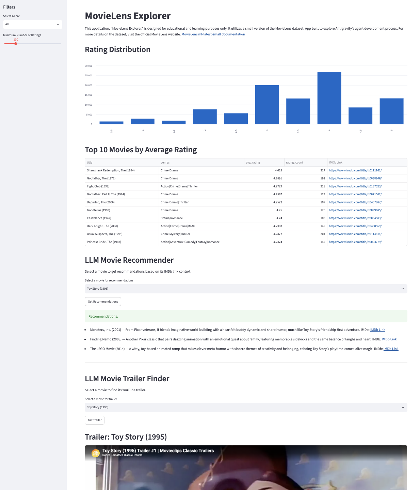

*Stack: Antigravity (agent mode), Python, Streamlit, pandas, OpenAI Responses API (gpt-5 with web
search), Streamlit Cloud.*

## Summary

A [hello world](https://en.wikipedia.org/wiki/%22Hello,_World!%22_program) Streamlit app on the
MovieLens dataset, built with Antigravity's agent mode. My first prototype app built with no manual
code edits using an agentic coding tool.

The app was not the deliverable. It was a proven Antigravity use case for a vibe coding hands-on lab
at the MasterClass CFO org offsite in Q4 2025, which the Senior Director of Data Science & AI and I
designed. ~50 attended, ~90% shipped a working app to spec, ~15% went well past it.

The workshop made vibe coding tangible across teams.

Live at [movielens-explorer.streamlit.app](https://movielens-explorer.streamlit.app/).

## Why I built this

At the time, the org knew vibe coding existed. Technical folks used the ChatGPT chat interface, or
Cursor and GitHub Copilot autocomplete. Few were using coding agents to write all the code for a
project.

I built the hello world app as the example artifact to prove out the hands-on lab build spec. I
wanted to gauge whether the app was within reach without specialized prompting or a coding
background. It was.

My usual workflow was prompting inside a Python or R notebook: manual edits, inline autocomplete,
targeted prompts for code chunks. Building this app replaced that pattern.

## What I built

A single Streamlit app over MovieLens ml-latest-small, deployed to Streamlit Cloud.

Two deterministic features: a rating distribution bar chart, and a top 10 table by average rating
with a minimum ratings slider and an IMDb link per movie. Both filter by genre. Two LLM powered
features: a recommender that returns 3 similar films with year, reason, and IMDb link, and a trailer
finder that returns a YouTube URL the app embeds with `st.video()`.

The build took an afternoon. I layered the OpenAI calls in after the deterministic features, to test
the LLM side specifically. I learned Streamlit Cloud can store secrets, which is what lets API
driven features run inside a public open source app.

{fig-alt="Full page screenshot of the MovieLens Explorer Streamlit app. A left sidebar holds a genre dropdown set to All and a minimum ratings slider at 100. The main column shows a bar chart of rating counts that peaks at rating 4, a table of the top 10 movies by average rating led by The Shawshank Redemption at 4.429, an LLM recommender returning Monsters Inc, Finding Nemo, and The LEGO Movie as suggestions for Toy Story, and a trailer finder with the Toy Story 1995 trailer embedded below it."}

Agent mode was strong. No major break or gap in what it produced. I was surprised how fast
Antigravity built the app, using the higher tier models it offered for free at the time.

The bigger surprise was that the code worked first try, end to end, with no manual edits. My
previous experience was the opposite: the generated code would not work, and I would debug and hand
code my way to something that ran.

## Decisions & tradeoffs

**Zero manual code edits.** The lab was for people who do not write code, so the example had to be
built the way they would build it. I held to it. When the trailer came back wrong I did not open
`app.py`. I wrote it in `bugs.md` and left it. It was also a test of whether the no manual edits
pattern was something I could carry into my own workflow.

**Built iteratively, one feature and expectation at a time.** I wanted to validate the output in
smaller chunks and see how accurate agent mode was. With the model versions at the time,
one-shotting would often produce output off track from the expectation and add too much complexity.

**A lean working demo, not just a written spec.** We gave the questions the app should answer plus a
live example. The demo is what let 15% decide they could do way better.

## Mistakes & weak points

The weak point was the LLM outputs, not the code. The LLM features were a proof of concept, not
hardened features. A real app needs evals and robust QA. For the demo and workflow test, I left
known bugs unresolved: the trailer search would sometimes return a song, the video would sometimes
render broken in the UI, and getting a trailer would clear the recommendations. There are likely
other bugs in the LLM features. They were fast to build. Increasing the quality would take more
work.

Leaving those bugs was a decision. Not knowing how to catch them programmatically is the actual gap.

## Results

| | |
|---|---|
| Lab attendees | ~50, technical and non technical |
| Shipped a working app in session | ~90% |
| Went past the app spec | ~15% |
| Lab length | 4 hours: context setting, light training, build time, demos |
| Downstream rollout | Claude Code, ~10 person analytics team, early 2026 |
| Rollout time | 1 to 2 weeks, no training needed |

The 15% built their own creative interactions, custom designs, and games into their Streamlit apps.
For example, a crossword puzzle with LLM hints built on the MovieLens dataset.

The chain is the real result. The workshop planted the seed for fully agentic coding workflows and
tool use. It showed that agents can write all the code, and that both technical and non technical
folks can build something useful. When we moved the analytics team to Claude Code in early 2026, the
transition took one to two weeks and needed no training. It felt like a minor tool switch, not a new
behavior to create.

## Top Learnings

**Learn by building.** First hand experience is what makes the value tangible. It moved vibe coding
from an AI buzzword to an idea people from any background can use.

**Share a light demo and spec, then get out of the way.** A rough guide for where folks should go
was enough to unleash creativity across the group.

**Adding features that call an API is low lift. Evaluating what those features return is more
work.** I can build an LLM feature in minutes. Designing the system that verifies what it returns is
the harder problem. That is the weak point in my AI stack right now.

## What's next

Build the tools and understanding for verification and evals on LLM features and agentic workflows.

The app itself is not meant to be used or adopted. Looking back it is comical how simple and basic
it is. I see it the way a painter keeps their first painting on display, or a surfer keeps their
first surfboard hanging in the garage. A time capture and a token of the moment.
